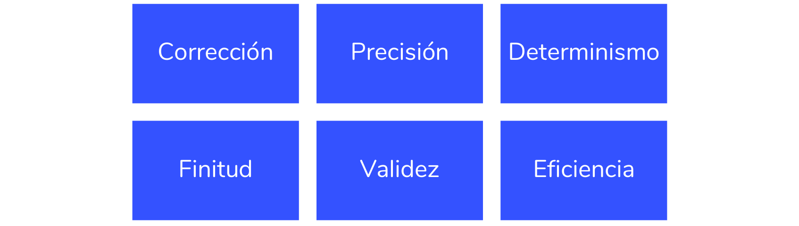
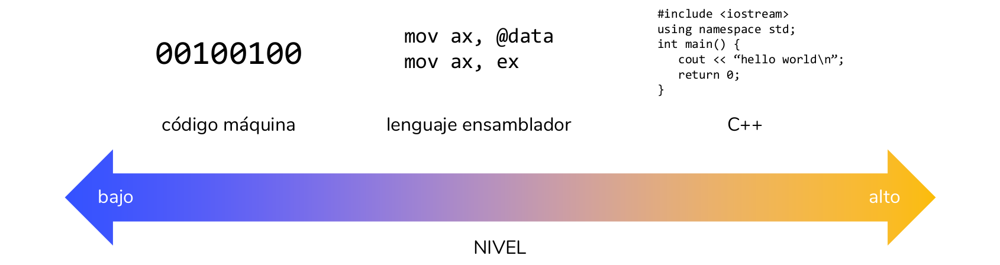

### Tema 1.  
# "Hello world". Introducción a la programación en C++

> **Clases de programación en C++** · agosto de 2018  
> Miguel Ángel Fernández Gutiérrez ([@mianfg](https://mianfg.bloomgogo.com))

- - -

## 👉 Tabla de contenidos

Concepto de dato
Lenguaje de programación
Implementación y especificación
Compilación y ejecución
Tipos de datos. Variables y operadores. Expresiones
Primer programa: hello world

1. [Concepto de algoritmo](#1-estructuras-de-control-de-flujo)
2. [Concepto de dato](#2-la-estructura-de-selección)  
3. [La estructura de iteración: diseño de bucles](#3-la-estructura-de-iteración-diseño-de-bucles)  
    3.1 [El bucle `while` y `do`-`while`](#31--el-bucle-while-y-do-while)  
    3.2 [El bucle `for`](#32--el-bucle-for)  
4. [Anidamiento de estructuras](#4-anidamiento-de-estructuras)

##### Ejemplos

* [Ejemplo 2.1](#ejemplo-21--comprobar-si-un-número-es-par) — comprobar si un número es par
* [Ejemplo 2.2](#ejemplo-22--comprobar-si-un-número-es-par-versión-modificada) — comprobar si un número es par (versión modificada)
* [Ejemplo 2.3](#ejemplo-23--comprobaciones-de-divisibilidad) — comprobaciones de divisibilidad
* [Ejemplo 2.4](#ejemplo-24--iterando-con-while) — iterando con `while`

- - -

## 1. Concepto de algoritmo

Un algoritmo es un conjunto ordenado de operaciones sistemáticas que permite hacer un cálculo y hallar la solución de un tipo de problemas.

> Definición más formal:  
> “Secuencia finita y ordenada de instrucciones determinísticas y precisas tal que ejecutadas en un tiempo finito da respuesta al problema para el que ha sido diseñado.”

#### Propiedades de un algoritmo

- - -

## 2. Concepto de dato

Un **dato** es una representación simbólica de una característica o propiedad de una entidad.

Los algoritmos operan sobre **datos de entrada** y **datos de salida**.

- - -

##### Ejemplo 1.1 - primer algoritmo: cálculo de la media

- Datos de entrada: `valor_1`, `valor_2`, ..., `valor_n`
- Datos de salida: `media`

Pseudocódigo:

~~~
sumar los n valores
dividir el resultado por n
devolver resultado
~~~

- - -

## 3. Lenguaje de programación

Un **lenguaje de programación** es un conjunto de símbolos y reglas sintácticas y semánticas que definen su estructura y el significado de sus elementos y expresiones.

Al proceso por el cual se escribe, se prueba, se depura, se compila (de ser necesario) y se mantiene el código fuente de un programa informático se le llama **programación**.

- - -

## 4. Implementación y especificación

La **implementación** es la puesta en marcha de una idea, la transcripción de un algoritmo a un lenguaje de programación.

Cada lenguaje, como hemos visto, tiene sus propias instrucciones, su propia sintaxis. La implementación se escribe en un fichero de texto, llamado **código fuente**.

> La convención de extensión para código fuente en C++ es `.cpp`

La **especificación** son el conjunto de complementos al algoritmo en sí, que incrementan la legibilidad y comprensión del programa.

Se compone de:
- **Comentarios:** `//` a principio de línea o `/* ... */`.
- **Sentencias:** en general, cada una de las líneas del código
- **Estructuras, clases y funciones:** las veremos más adelante.

- - -

## 5. Compilación y ejecución

La **compilación** es el proceso de traducción de un programa escrito en un lenguaje de programación a un lenguaje que el ordenador es capaz de comprender, el **lenguaje máquina**.

Cuando ejecutamos un programa, ejecutamos un programa ya compilado, es decir, un programa que ya ha sido traducido. Es necesario “traducir” para poder ejecutar el programa.

- - -

## 6. Tipos de datos. Variables y operadores. Expresiones

### 6.1  Tipo de dato: concepto

Un **tipo de dato** es una clasificación de un conjunto de datos con la misma naturaleza y estructura, a los que se les puede aplicar un conjunto de operaciones definido.

Existen tres tipos de tipos de datos en C++:
- **Primitivos:** implementados de forma nativa por C++.
- **Abstractos:** definidos por el programador.
- **Estructurados:** contienen dos o más tipos de datos en él.

### 6.2  Tipos de datos primitivos

#### Tipo de dato `int`

#### Tipos de dato `float` y `double`

#### Tipo de dato `char`

#### Tipo de dato `string`

#### Tipo de dato `bool`

### 6.3  Variables: declaración, inicialización, asignación y acceso

Una **variable** es una zona de memoria reservada para almacenar un dato de un tipo dado, accesible (para lectura y/o escritura) mediante un **identificador** (nombre simbólico).

- Declaración de una variable: `<tipo> <identificador>;`  
    _¿Qué valor tiene aquí la variable?_
- Asignación de valor a variable: `<identificador> = <literal>;`
- Inicialización: `<tipo> <identificador> = <literal>;`

Podemos **acceder** al valor almacenado en una variable escribiendo el identificador de dicha variable.

~~~ c++
// declaración
int valor;

// acceso: ¿qué valor tiene?
cout << valor << endl;

// asignación
valor = 7;

// declaración con inicialización
bool valor2 = true;

// acceso
cout << valor << ' ' << valor2 << '\n';
~~~

### 6.4  Operadores: entrada/salida estándar, `cin` y `cout`

Al hacer uso de la biblioteca `iostream`, podemos hacer uso del flujo de entrada por teclado y salida por pantalla (**flujo estándar**).

~~~ c++
/* Variación del programa anterior:
   vamos a pedir el valor por pantalla */

// declaración
int valor;

// mensaje: operador de salida
cout << "Inserte un valor decimal: ";

// operador de entrada
cin >> valor;

// mostrar valor: operador de salida
cout << "valor" << '=' << valor << endl;
~~~

- - -

## 7. Primer programa: `hello world`

Un programa básico de C++ se compone, generalmente, de:

1. Los **“`include`”**: bibliotecas y clases externas.
2. **`using namespace std`**: el espacio de nombres del `std`, que utilizaremos continuamente.
3. La **función `main()`**: es la que ejecuta C++ de forma nativa al iniciar el programa.

~~~ c++
#include <iostream>     // 1. Los "include"
using namespace std;    // 2. using namespace std
int main() {            // 3. Función main()
    cout << "hello world" << endl;
    return 0;   // significa que ha ido todo bien, todo correcto
}
~~~

- - -

## Repaso de conceptos

- ¿Qué es un algoritmo? ¿Qué es programar?
- Elementos básicos que componen un programa
- Estructura básica de un programa en C++
- Uso de los principales tipos de dato y operadores de C++
- Uso de un IDE (Integrated Development Environment) básico para la compilación y ejecución de programas de un archivo
- Comprensión de los operadores de entrada/salida estándar `cin` y `cout`
- Creación de algoritmos básicos
