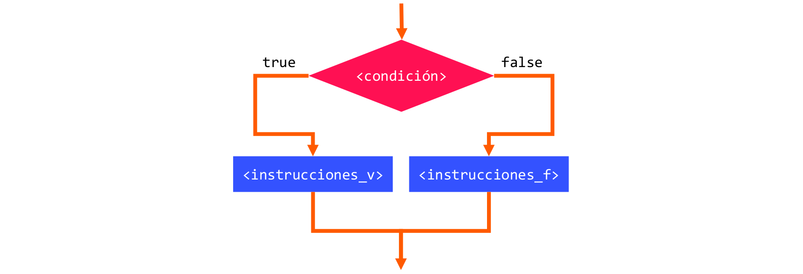
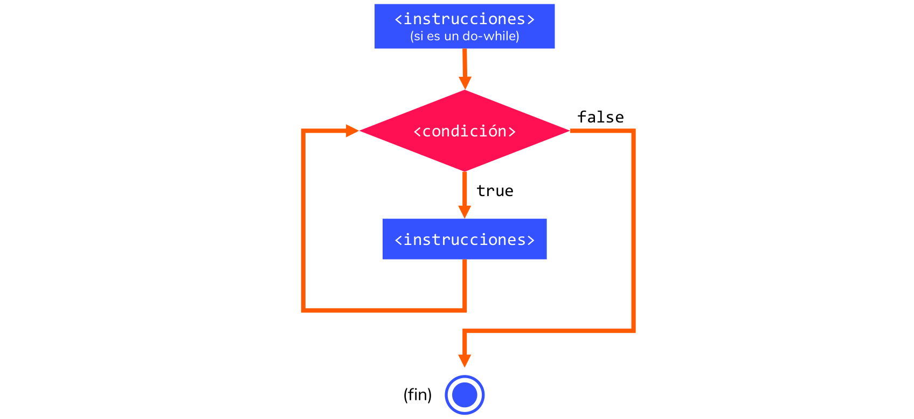
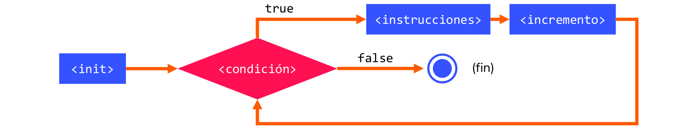

### Tema 2.  
# Estructuras de iteración y selección

> **Clases de programación en C++** · agosto de 2018  
> Miguel Ángel Fernández Gutiérrez ([@mianfg](https://mianfg.bloomgogo.com))

- - -

## 👉 Tabla de contenidos

1. Las estructuras de control de flujo
2. La estructura de selección  
    2.1 Las estructuras `if` e `if`/`else`  
    2.2 Condiciones compuestas: operadores lógicos  
3. La estructura de iteración: diseño de bucles  
    3.1 El bucle `while` y `do`-`while`  
    3.2 El bucle `for`  
4. Anidamiento de estructuras

- - -

## 1. Estructuras de control de flujo

El interés del diseño de algoritmo radica en poder ejecutar instrucciones dependiendo de condiciones.

Un ejemplo de un programa que no se podría realizar con las instrucciones que conocemos: detectar si un número es par o no.

Necesitamos una forma de controlar cuándo queremos ejecutar una instrucción u otra: **control de flujo**.

En un lenguaje de programación, las **estructuras de control** permiten modificar el **flujo de ejecución** de las instrucciones de un programa. Es uno de los componentes esenciales del **paradigma de programación estructurada**.

Podemos clasificarlas en:
- **Estructuras selectivas:** ejecutan según condiciones lógicas.
- **Estructuras iterativas:** repiten un bloque según condiciones.

- - -

## 2. La estructura de selección

Las **estructuras de control de selección** ejecutan un bloque de instrucciones u otro, o saltan a un subprograma o subrutina según se cumpla o no una condición.

En C++ tenemos las siguientes:
- `if` (estructura de selección simple)
- `if ... else` (estructura de selección simple)
- `if ... else if ... else` (estructura de selección compuesta)
- `switch`/`case` (estructura de selección compuesta)

### 2.1  Las estructuras `if` e `if`/`else`

~~~ c++
if (<condición>) {
    <instrucciones_v>
} else {
    <instrucciones_f>
}
~~~

- - -

##### Ejemplo 2.1 — comprobar si un número es par

~~~ c++
int num;

cout << "Introduce entero: ";
cin >> num;

if ( num % 2 == 0 )
    cout << num << " es par\n";
else
    cout << num << " es impar\n";
~~~

- - -

##### Ejemplo 2.2 — comprobar si un número es par (versión modificada)

_¿Cuál es la diferencia entre este ejemplo y el anterior? ¿Qué ocurriría si intentásemos comprobar la divisibilidad por otros números?_

~~~ c++
int num;

cout << "Introduce entero: ";
cin >> num;

if ( num % 2 == 0 )
    cout << num << " es par\n";
if ( num % 2 != 0 )
    cout << num << " es impar\n";
~~~

- - -

### 2.2  Condiciones compuestas: operadores lógicos

~~~ c++
if (<condición_1>) {
    <instrucciones_1>
} else if (<condición_2>) {
    <instrucciones_2>
} ... {
    ...
} else {
    <instrucciones_f>
}
~~~

Esta estructura es similar a la anterior, pero evalúa los `if`s de la siguiente manera: si se cumple la primera condición, evalúa su cuerpo, si no, comprueba si se cumple la segunda, y así sucesivamente hasta ejecutar el cuerpo del `else` en caso de que no se cumpla ninguna de las anteriores.

En `<condición>`, debemos insertar una **expresión lógica**. Las expresiones lógicas son construcciones con **operadores lógicos** (aunque también pueden incluir otros operadores).

> Los operadores lógicos fueron vistos en el bloque anterior.

El resultado de una expresión lógica es un valor booleano (`true` o `false`). Cuando el programa encuentra un `if`, evalúa la condición y ejecuta su cuerpo si el resultado es `true`.

- - -

##### Ejemplo 2.3 — comprobaciones de divisibilidad

~~~ c++
... // código para leer num por entrada estándar

if ( num % 2 == 0 )
    cout << num << "es múltiplo de 2\n";
else if ( num % 4 == 0 )
    cout << num << "es múltiplo de 4\n";
else if ( num % 5 == 0 )
    cout << num << "es múltiplo de 5\n";
else
    cout << num << "es un número :)\n";
~~~

_¿Qué mostrará este código si..._
- _`num` es múltiplo de 2?_
- _`num` es múltiplo de 5?_
- _`num` es múltiplo de 4?_
- _`num` es múltiplo de 2 y no de 4?_
- _`num` no es múltiplo de 2, ni de 4, ni de 5?_

- - -

### 2.3  La estructura de bifurcación `switch`

El cuerpo de la estructura de bifurcación `switch` es como sigue:

~~~ c++
switch (<var>) {
    case <caso_1>:
        <instrucciones_1>
        break;
    ...
    case <caso_n>:
        <instrucciones_n>
        break;
    default;
        <instrucciones_d>
        break;
~~~

En donde `<var>` **debe ser** una variable de tipo `int`, y el cual es completamente equivalente a:

~~~ c++
if ( <var> == <caso_1> ) {
    <instrucciones_1>
} ... {
    ...
} else if ( <var> == <caso_n> ) {
    <instrucciones_n> {
} else {
    <instrucciones_d>
}
~~~

> **Una matización:** nótese cómo en el `switch` utilizamos el nombre `break`. Esto es así para mantener la estructura de bifurcación característica del `if`/`else if`/`else`, la más característica en programación. Si omitiésemos el `break`, también se comprobaría la condición siguiente, y no se saldría del `switch` al verificar alguno de los casos.

- - -

## 3. La estructura de iteración: diseño de bucles

Las **estructuras de control iterativas** o **de repetición** inician o repiten un bloque de instrucciones si se cumple una condición o mientras se cumple una condición.

En C++ tenemos las siguientes:
- Bucle `while` (***post-test***) y `do`-`while` (***pre-test***).
- Bucle `for` (**iterador**).

### 3.1  El bucle `while` y `do`-`while`

#### Bucle `while` (***post-test***)

~~~ c++
while (<condición>) {
    <instrucciones>
}
~~~

#### Bucle `do`-`while` (***pre-test***)

Este bucle fuerza la primera iteración del `while`.

~~~ c++
do {
    <instrucciones>
} while (<condición>);
~~~

Nótese cómo el `do`-`while` es exactamente equivalente a un `while` con las instrucciones repetidas en precondición.

~~~ c++
<instrucciones>
while (<condición>) {
    <instrucciones>
}
~~~

- - -

El esquema de flujo para estos bucles es:

- - -

##### Ejemplo 2.4 — iterando con `while`

~~~ c++
int i = 0;

while ( i <= 100 ) {
    cout << i << ' ';
    i++;
}
~~~

_¿Qué hace este código? ¿Qué pasaría si..._
- _omitiésemos la línea `i++;`?_
- _sustituyésemos el `<=` por `<` en `while ( i <= 100 )`?_
- _intercambiásemos las líneas `cout << i << ' ';` y `i++;`?_
- _lo hiciésemos con un `do`-`while`?_
- _cambiásemos la línea `i++;` por `i += 2;`?_
- _cambiásemos la línea `int i = 0;` por `int i;`?

- - -

### 3.2  El bucle `for`

~~~ c++
for (<init>; <condición>; <incremento>) {
    <instrucciones>
}
~~~

- - -

## 4. Anidamiento de estructuras

Las estructuras de control de flujo pueden ser **anidadas** a conveniencia: podemos colocar una estructura dentro de otra (un `if` dentro de un `while`, un `for` dentro de un `if`...).

Sin embargo, hay que tener cuidado: anidar estructuras puede hacer nuestro programa más lento e ineficiente (incluso dar fallos en nociones más avanzadas de programación, como el uso de memoria dinámica). Debemos siempre ser muy conscientes de qué queremos anidar, y si existe alguna otra alternativa que nos permita no utilizarlo, será mucho mejor si no complica el código en exceso.

- - -

## Repaso de conceptos

- ¿Qué es el flujo de ejecución de un programa?
- Uso de todas las estructuras de control de flujo
- Comprensión de la funcionalidad de cada estructura
- Conocimiento de la posibilidad de anidamiento
