### Tema 3.  
# Vectores y matrices

> **Clases de programación en C++** · agosto de 2018  
> Miguel Ángel Fernández Gutiérrez ([@mianfg](https://mianfg.bloomgogo.com))

- - -

## 👉 Tabla de contenidos

1. [Motivación al uso de vectores](#1-motivación-al-uso-de-vectores)
2. [Concepto de vector](#2-concepto-de-vector)
3. [Operaciones básicas con vectores](#3-operaciones-básicas-con-vectores)  
    3.1 [Declaración](#31--declaración)  
    3.2 [Asignación](#32--asignación)  
    3.3 [Acceso: operador `[]`](#33--acceso-operador-)  
    3.4 [Modificación (asignación por elementos)](#34--modificación-asignación-por-elementos)  
4. [Operaciones específicas de la clase `vector`](#4-operaciones-específicas-de-la-clase-vector)  
    4.1 [Acceso y modificación: operador `at()`](#41--acceso-y-modificación-operador-at)  
    4.2 [Comprobación de tamaño: `size()`](#42--comprobación-de-tamaño-size)  
    4.3 [Variación de tamaño: `push_back()`, `pop_back()`, `clear()`](#43--variación-de-tamaño-push_back-pop_back-y-clear)  
    4.4 [Otros operadores](#44--otros-operadores)  
5. [Recorridos sobre vectores](#5-recorridos-sobre-vectores)  
    5.1 [Algoritmos de búsqueda](#51--algoritmos-de-búsqueda)  
        — 5.1.1 [Búsqueda secuencial](#511--algoritmo-de-búsqueda-secuencial)  
        — 5.1.2 [Búsqueda binaria](#512--algoritmo-de-búsqueda-binaria)  
        — 5.1.3 [Otros algoritmos de búsqueda](#513--otros-algoritmos-de-búsqueda)  
    5.2 [Modificación de elementos de un vector](#52--modificación-de-los-elementos-de-un-vector)  
        — 5.2.1 [Inserción de un valor](#521--inserción-de-un-valor)  
        — 5.2.2 [Eliminación de un valor](#522--eliminación-de-un-valor)  
    5.3 [Algoritmos de ordenación](#53--algoritmos-de-ordenación)  
        — 5.3.1 [Ordenación por selección](#531--ordenación-por-selección)  
        — 5.3.2 [Ordenación por inserción](#532--ordenación-por-inserción)  
        — 5.3.3 [Ordenación por intercambio directo (_método de la burbuja_)](#533--ordenación-por-intercambio-directo-método-de-la-burbuja)  
6. [Concepto de matriz](#6-concepto-de-matriz)
7. [Vectores vs. arrays](#7-vectores-vs-arrays)

##### Ejemplos y algoritmos

* [Ejemplo 3.1](#ejemplo-31--resolución-parcial-del-problema-de-las-notas-versión-1) — resolución parcial del problema de las notas (versión 1)
* [Ejemplo 3.2](#ejemplo-32--resolución-parcial-del-problema-de-las-notas-versión-2) — resolución parcial del problema de las notas (versión 2)
* [Ejemplo 3.3](#ejemplo-33--resolución-del-problema-de-las-notas-versión-1) — resolución del problema de las notas (versión 1)
* [Ejemplo 3.4](#ejemplo-34--resolución-del-problema-de-las-notas-versión-2) — resolución del problema de las notas (versión 2)
* [Algoritmo 3.5](#algoritmo-35--búsqueda-secuencial) — búsqueda secuencial
* [Algoritmo 3.6](#algoritmo-36--búsqueda-binaria) — búsqueda binaria
* [Algoritmo 3.7](#algoritmo-37--búsqueda-del-máximo-de-un-vector) — búsqueda del máximo de un vector
* [Algoritmo 3.8](#algoritmo-38--encontrar-un-vector-dentro-de-otro) — encontrar un vector dentro de otro
* [Algoritmo 3.9](#algoritmo-39--inserción-de-un-valor-en-un-vector) — inserción de un valor en un vector
* [Algoritmo 3.10](#algoritmo-310--eliminación-de-un-valor-de-un-vector) — eliminación de un valor de un vector
* [Algoritmo 3.11](#algoritmo-311--algoritmo-de-ordenación-por-selección) — algoritmo de ordenación por selección
* [Algoritmo 3.12](#algoritmo-312--algoritmo-de-ordenación-por-inserción) — algoritmo de ordenación por inserción
* [Algoritmo 3.13](#algoritmo-313--método-de-la-burbuja-para-la-ordenación-de-vectores) — método de la burbuja para la ordenación de vectores

- - -

## 1. Motivación al uso de vectores

Queremos resolver el siguiente problema:

> Dado un conjunto de valores, queremos:
> * Calcular su media.
> * Decir cuántos alumnos superan la media.
> * calcular su moda.

Para contextualizar el problema, digamos que esos valores son las notas de una clase.

- - -

##### Ejemplo 3.1 — resolución parcial del problema de las notas (versión 1)

Comenzaremos resolviendo el problema usando los conocimientos del tema anterior acumulando las notas insertadas en una variable, mediante la cual calcularemos la media. Sin embargo, de este modo es imposible decir cuántos alumnos superan la media, pues no tenemos los alumnos almacenados _per se_.

~~~ c++
int contador = 0;
double media = 0, entrada;
double nota_max = 0;

cout << "Inserte las notas hasta insertar una no válida: ";
	
do {
	cin >> entrada;
	if ( entrada >= 0 && entrada <= 10 ) {
		if ( entrada > nota_max )
			nota_max = entrada;
		media += entrada;
		contador++;
	}
} while ( entrada >= 0 && entrada <= 10 );
media /= contador;
cout << "La media es: " << media << endl;
~~~

- - -

##### Ejemplo 3.2 — resolución parcial del problema de las notas (versión 2)

Podemos resolver el problema también de la siguiente forma, dejando la moda:

~~~c++
int nota_1, nota_2, nota_3;

cout << "Inserte las notas: ";
cin >> nota_1 >> nota_2 >> nota_3;

int media = (nota_1 + nota_2 + nota_3)/3, superan_media = 0;

if (nota_1 > media)
    superan_media++;
if (nota_2 > media)
    superan_media++;
if (nota_3 > media)
    superan_media++;

cout << "La media de las notas es: " << media << endl
     << "El número de notas que superan la media es: "
     << superan_media << endl;
~~~

Apreciemos cómo es necesario constatar dónde vamos a almacenar cada una de las notas, por lo que es necesario declarar una variable para cada nota. Por ello, hemos resuelto el problema para _n = 3_.

¿Qué pasa si queremos resolver el problema general, esto es, para cualquier _n_? **¡Para eso tenemos los vectores!**

- - -

## 2. Concepto de vector

Un objeto de tipo vector es una estructura de datos que cumple:

- Es **compuesto**: puede contener múltiples objetos.
- Es **homogéneo**: todos los objetos deben ser del mismo tipo.

Al declarar un vector de un cierto tamaño, estamos declarando muchas variables de un mismo tipo encadenadas en memoria.

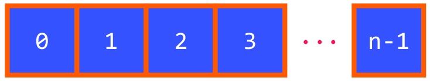

Por ejemplo, si tuviésemos un vector de _n_ valores de tipo `double`, podríamos almacenar _n_ notas diferentes, de forma encadenada.

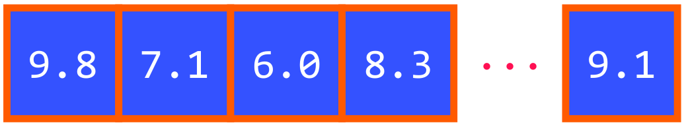

Esto nos permite agilizar nuestro código de forma significativa, debido a que los vectores nos permiten realizar operaciones.

> MUY IMPORTANTE  
> El tipo vector no está definido en el lenguaje, sino en una clase de C++ contenida en std. Para hacer uso de él, es **necesario incluir el fichero de cabecera `vector`**.
> ~~~c++
> #include <vector>
> ~~~

- - -

Para poder manejar cada uno de los elementos contenidos, el vector los organiza mediante un **índice**.

Tomando el mismo ejemplo anterior, los índices quedarían:

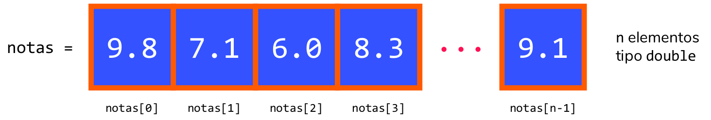

En general, podemos representar un vector con el siguiente esquema:

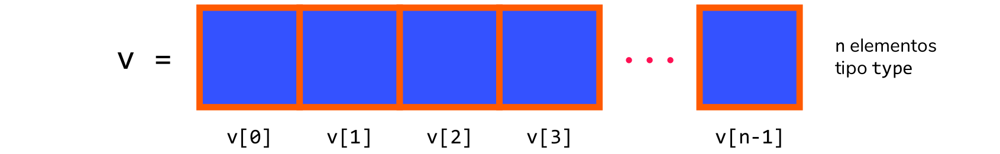

- - -

## 3. Operaciones básicas con vectores

### 3.1  Declaración

Para trabajar con objetos, debemos **crearlos**. Es para ello necesario especificar el tipo contenido. Opcionalmente, se puede especificar el tamaño y el valor con el que inicializarlo.

#### Vector de tipo `type` y tamaño cero

~~~ c++
vector<type> v;
~~~

De este modo, hemos creado un vector de `type` vacío.

#### Vector de tipo `type` y tamaño `n`

~~~ c++
vector<type> v(n);
~~~

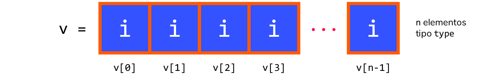

De este modo, hemos creado un vector de `type` de `n` elementos. Dependiendo del tipo, se inicializarán a un valor u otro (_¡experimenta para comprobarlo!_).

#### Vector de tipo `type` y tamaño `n` inicializado a `i`

~~~ c++
vector<type> v(n, i);
~~~

De este modo, hemos creado un vector de `type` de `n` elementos, en el que todos los elementos tienen el valor `i` (inicialización), que debe ser de tipo `type`.

### 3.2  Asignación

Podemos asignar un vector a otro, o inicializarlo con un vector _raw_, es decir, un vector escrito de la forma `{...}`, siempre que todos los elementos sean del mismo tipo que el vector declarado.

~~~ c++
vector<double> notas = {9.8, 7.2, 5.6, 9.2, 8.8};
vector<double> notas_2 = notas;
~~~

### 3.3  Acceso: operador `[]`

Para acceder al valor con índice `i` del vector `v`, basta hacer **`v[i]`**.

### 3.4  Modificación (asignación por elementos)

Podemos usar los operadores anteriores para hacer uso de la asignación para cada uno de los valores individuales.

~~~ c++
notas[0] = 6;  // modifica notas a 6.0
~~~

- - -

## 4. Operaciones específicas de la clase `vector`

### 4.1  Acceso y modificación: operador `at()`

Podemos usar en lugar del operador `[]` el operador `at()`, incorporado en la clase vector.

> La diferencia entre `at()` y `[]` se encuentra explicada en la relación de ejercicios.

~~~ c++
cout << notas.at(0);  // lo mismo (casi) que cout << notas[0]
notas.at(0) = 10;     // lo mismo (casi) que notas[0] = 10
~~~

### 4.2  Comprobación de tamaño: `size()`

Esta función de la clase `vector` devuelve un dato de tipo `int`, correspondiente al número de elementos del `vector`.

~~~ c++
cout << notas.size();  // muestra 5
~~~

- - -

> ***¡Ya estamos en condiciones de resolver nuestro problema!***

##### Ejemplo 3.3 — resolución del problema de las notas (versión 1)

~~~ c++
#include<iostream>
#include<vector>
using namespace std;

int main() {
    int num_notas;
    cout << "Inserte cuántas notas insertará: ";
    cin >> num_notas;

    vector<double> notas(num_notas);
    for ( int i = 0; i < notas.size(); i++ )
        cin >> notas[i];
    
    double media = 0;
    for ( int i = 0; i < notas.size(); i++ )
        media += notas[i];
    media /= notas.size();
    double moda = 0;

    int superan_media = 0;
    for ( int i = 0; i < notas.size(); i++ )
        if ( notas[i] > media )
            superan_media++;

    for ( int i = 0; i < notas.size(); i++ )
        if ( notas[i] > moda )
        moda = notas[i];

    cout << "Media: " << media << endl
         << "Superan la media: " << superan_media << endl
         << "Moda: " << moda << endl;
}
~~~

- - -

### 4.3  Variación de tamaño: `push_back()`, `pop_back()` y `clear()`

| Imagen | Función | Descripción |
| --- | --- | --- |
| 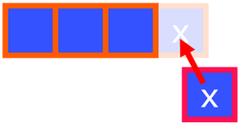 | `v.push_back(x)` | Inserta al vector el elemento `x` al final de éste. Debe ser del mismo tipo que el vector. |
| 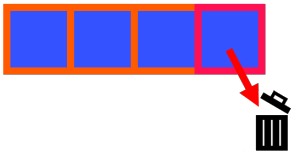 | `v.pop_back()` | Elimina el último elemento del vector. |
| 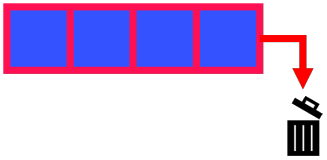 | `v.clear()` | Vacía el vector. |

- - -

> ***¡Ahora podemos mejorar la solución a nuestro problema!***

##### Ejemplo 3.4 — resolución del problema de las notas (versión 2)

~~~ c++
#include<iostream>
#include<vector>
using namespace std;

int main() {
    vector<double> notas;
    double entrada;

    cout << "Inserte todas las notas que quiera,
            finalice con una nota no válida: ";
    
    do {
        cin >> entrada;
        if ( entrada >= 0 && entrada <= 10 )
            notas.push_back(entrada);
    } while ( entrada >= 0 && entrada <= 10 );

    double media = 0;
    for ( int i = 0; i < notas.size(); i++ )
        media += notas[i];
    media /= notas.size();
    double moda = 0;

    int superan_media = 0;
    for ( int i = 0; i < notas.size(); i++ )
        if ( notas[i] > media )
            superan_media++;

    for ( int i = 0; i < notas.size(); i++ )
        if ( notas[i] > moda )
        moda = notas[i];

    cout << "Media: " << media << endl
         << "Superan la media: " << superan_media << endl
         << "Moda: " << moda << endl;
}
~~~

- - -

### 4.4  Otros operadores

La clase `vector` tiene definida multitud de operadores. Sin embargo, con los anteriores, podemos resolver todos los problemas que hagan falta con vectores.

En la relación de ejercicios se introducen otros operadores. La lista completa la puedes ver en la referencia de C++:

<http://www.cplusplus.com/reference/vector/vector/>

- - -

## 5. Recorridos sobre vectores

### 5.1  Algoritmos de búsqueda

Los **algoritmos de búsqueda** son unos de los algoritmos más utilizados para todo tipo de tareas. Su objetivo es localizar el índice de un elemento específico en un vector.

Existen diversos tipos de algoritmos, pero veremos dos:

* **Algoritmo de búsqueda secuencial o lineal:** muy sencillo pero poco eficiente.
* **Algoritmo de búsqueda binaria:** muy eficiente, requiere que el vector esté ordenado.

#### 5.1.1  Algoritmo de búsqueda secuencial

El objetivo de este algoritmo es recorrer el vector hasta encontrar el elemento buscado.

- - -

##### Algoritmo 3.5 — búsqueda secuencial

> 😏 Este es un algoritmo muy importante: que lo entiendas es **fundamental**. Por eso, **¡intenta resolverlo tú primero!**

###### Pseudocódigo

~~~
recorrer las componentes del vector
    - hasta que se llegue al final del vector
    - hasta que encontremos el elemento a buscar
~~~

###### Código en C++. Versión 1: usando `while`

~~~ c++
vector<type> v(<tamaño>);
<type> buscado = <elemento_a_buscar>

int i = 0;
int indice_encontrado = -1;
bool encontrado = false;

while ( i < v.size() && !encontrado ) {
    if ( v[i] == buscado ) {
    	encontrado = true;
	indice_encontrado = i;
    } else
    	i++;
}
~~~

###### Código en C++. Versión 2: usando `for`

~~~ c++
vector<type> v(<tamaño>);
<type> buscado = <elemento_a_buscar>

int indice_encontrado = -1;
bool encontrado = false;

for ( int i = 0; i < v.size() && !encontrado; i++ ) {
    if ( v[i] == buscado ) {
    	encontrado = true;
	indice_encontrado = i;
    }
}
~~~

###### Casos clave a comprobar para este algoritmo

* Que el valor a buscar esté al principio.
* Que el valor a buscar esté en medio.
* Que el valor a buscar esté al final.
* Que el valor a buscar no se encuentre.
* Que el valor a buscar se encuentre varias veces.
* Que el vector esté vacío.
* Que el vector tenga un único componente.

- - -

#### 5.1.2  Algoritmo de búsqueda binaria

Para poder ejecutar este algoritmo, el vector **debe estar ordenado**. La idea es crear tres localizadores para delimitar la lista, e ir ensanchando la búsqueda.

* `izquierda` es el delimitador de la izquierda.
* `derecha` es el delimitador de la derecha.
* `centro` es la posición central entre el delimitador izquierdo y el derecho (se calcula haciendo `(derecha-izquierda)/2`, nótese que en caso de que no haya un elemento central se toma el que se encuentra algo a la izquierda por el truncamiento natural del tipo `int`).

Comprobaremos continuamente si `centro` es el elemento que queremos buscar, e iremos cambiando los delimitadores para buscar dicho elemento (la idea es que el elemento que queremos buscar siempre esté entre `izquierda` y `derecha`, y lo localizaremos con `centro`).

En la siguiente animación se aprecia mejor este algoritmo:

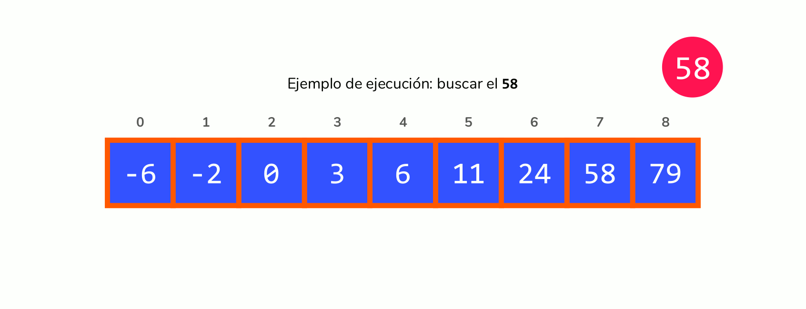

Es **importante** notar que este algoritmo no garantiza que se encuentre la primera posición en caso de que el dato a buscar se encuentre repetido.

- - -

##### Algoritmo 3.6 — búsqueda binaria

> 😏 Este es un algoritmo muy importante: que lo entiendas es **fundamental**. Por eso, **¡intenta resolverlo tú primero!**

###### Pseudocódigo

~~~
comparamos el elemento a buscar con el elemento en el centro del vector
si coinciden, el elemento se ha encontrado
si es mayor que él, se repite el proceso con la mitad inferior
si es menor que él, se repite el proceso con la mitad superior
~~~

###### Código en C++

~~~ c++
vector<type> v(<tamaño>);
<type> buscado = <elemento_a_buscar>

int izquierda = 0;
int derecha = v.size() - 1;
int centro;
int indice_encontrado = -1;
bool encontrado = false;

while ( izquierda <= derecha && !encontrado ) {
    centro = (derecha - izquierda)/2;
    
    if ( v[centro] == buscado ) {
    	indice_encontrado = centro;
	encontrado = true;
    } else if ( buscado < v[centro] )
    	derecha = centro - 1;
    else
    	izquierda = centro + 1;
}
~~~

###### Casos clave a comprobar para este algoritmo

* Que el valor a buscar esté al principio.
* Que el valor a buscar esté en medio.
* Que el valor a buscar esté al final.
* Que el valor a buscar no se encuentre.
* Que el valor a buscar se encuentre varias veces (ver nota suuperior).
* Que el vector esté vacío.
* Que el vector tenga un único componente.

- - -

#### 5.1.3  Otros algoritmos de búsqueda

En lugar de buscar un elemento específico, podremos buscar un elemento más característico, como el máximo o el mínimo de un vector, e incluso un vector en sí mismo.

- - -

##### Algoritmo 3.7 — búsqueda del máximo de un vector

> 😏 Este es un algoritmo muy importante: que lo entiendas es **fundamental**. Por eso, **¡intenta resolverlo tú primero!**

~~~ c++
vector<type> v(<tamaño>);
<type> buscado = <elemento_a_buscar>

int indice_maximo = -1;

if ( v.size() > 0 )
    indice_maximo = 0;

for ( int i = 0; i < v.size(); i++ )
    if ( v[i] >= v[indice_maximo] )
    	indice_maximo = i;
~~~

- - -

##### Algoritmo 3.8 — encontrar un vector dentro de otro

> 😏 Este es un algoritmo muy importante: que lo entiendas es **fundamental**. Por eso, **¡intenta resolverlo tú primero!**

~~~ c++
vector<type> v(<tamaño>);
vector<type> v2(<tamaño_2>);

// queremos comprobar si v2 está en v, y almacenar el inicio de v2 en v
int inicio_vector = 0;
int j = 0;
bool encontrado = false;

for ( int i = 0; i < v.size() && !encontrado )
    if ( v[i] == v2[j] ) {
    	j++;
	if ( j == v2.size() )
	    encontrado = true;
    } else {
    	j = 0;
	inicio_vector = i;
	i--;
    }
~~~

- - -

### 5.2  Modificación de los elementos de un vector

La clase vector incorpora multitud de funciones para poder variar los elementos del vector, así como el tamaño de éste. Hemos visto las funciones `push_back()`, `pop_back()` y `clear()`, pero... ¿y si queremos insertar o eliminar valores que no estén necesariamente al final del vector?

Existen funciones, como hemos dicho, ya hechas para este cometido en la clase `vector`, pero... **¿por qué no las hacemos nosotros?** Aquí van algunas...

#### 5.2.1  Inserción de un valor

En este algoritmo, insertaremos el valor `insertar_valor` en la posición `insertar_posicion` del vector `v`. En este caso, haremos uso de `push_back()` para crear un segundo vector, `v_insertado`, en el que se encontrará el valor insertado. Luego, si queremos guardar nuestros cambios en `v`, reasignaremos `v_insertado` a `v`. Finalmente, tendremos dos copias de un mismo vector, lo cual no es óptimo en memoria. Por ello, hacemos `clear()` sobre `v_insertado`, para quedarnos únicamente con `v`.

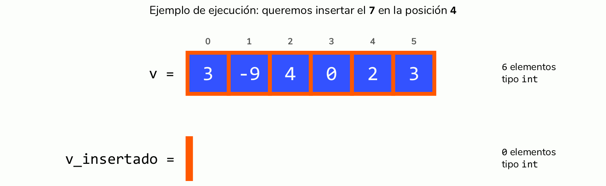

**Muy importante:** esta es una solución posible, pero ni mucho menos es la más óptima. De hecho, hemos hecho uso de funciones de la clase `vector`, por lo que no podríamos usar este algoritmo con arrays. Intenta hacer tú una solución alternativa, ¡hay multitud de ellas!

- - -

##### Algoritmo 3.9 — inserción de un valor en un vector

> 😏 Este es un algoritmo muy importante: que lo entiendas es **fundamental**. Por eso, **¡intenta resolverlo tú primero!**

~~~ c++
vector<type> v(<tamaño>);

<type> insertar_valor = <valor_a_insertar>;
int insertar_posicion = <posicion_a_insertar>;

vector<type> v_insertado;  // el vector a devolver

// parte izquierda del vector (antes de la posición en la que queremos insertar)
for ( int i = 0; i < insertar_posicion )
    v_insertado.push_back(v[i]);

// insertamos el elemento deseado, comprobando antes que la posición donde colocarlo es válida
if ( insertar_posicion <= v.size()
    v_insertado.push_back(insertar_valor);

// parte derecha del vector (completamos el vector)
for ( int i = insertar_posicion; i < v.size(); i++ )
    v_insertado.push_back(v[i]);

// opcionalmente podemos modificar v
v = v_insertado;
v_insertado.clear();  // para no desperdiciar memoria
~~~

###### Casos clave para comprobar este algoritmo

* Que queramos insertar nuestro elemento al principio.
* Que queramos insertar nuestro elemento al final.
* Que queramos insertar nuestro elemento en medio del vector.
* Que queramos insertar nuestro elemento en una posición no permitida:
	* Una posición con un valor menor que cero (índice inválido).
	* Un índice que exceda el tamaño del vector resultante (el índice máximo al que podemos llegar es a `v.size()`, en caso de que queramos insertar el elemento al final — luego el vector se redimensionaría para alojar un elemento más).

- - -

#### 5.2.2  Eliminación de un valor

Intentaremos resolver el problema de la siguiente manera: vamos a ir pasando, a partir del elemento que queremos eliminar, todos los vectores hacia la izquierda. Luego, bastará hacer `pop_back()` para eliminar el último elemento del vector, que será una copia del elemento anterior a él.

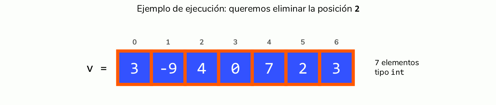

- - -

##### Algoritmo 3.10 — eliminación de un valor de un vector

> 😏 Este es un algoritmo muy importante: que lo entiendas es **fundamental**. Por eso, **¡intenta resolverlo tú primero!**

~~~ c++
vector<type> v(<tamaño>);
<type> buscado = <elemento_a_buscar>

int eliminar_posicion = <posicion_a_eliminar>;

for ( int i = eliminar_posicion; i < v.size() - 1; i++ )
    v[i] = v[i+1];

v.pop_back();
~~~

###### Casos clave para comprobar este algoritmo

* Que queramos eliminar un elemento en una posición no permitida.

- - -

### 5.3  Algoritmos de ordenación

Además de encontrar cosas, es imprescindible poder ordenar los vectores. De hecho, uno de los prerrequisitos del _binary search_ es que la lista esté ordenada.

Para poder ordenar vectores, el vector debe ser de un tipo en el que haya establecida una relación de orden.

Este problema es uno de los problemas más importantes en ciencias de la computación, por su gran cantidad de aplicaciones. Por eso, es necesario que la solución a este problema sea **óptima**, ya que es necesario ordenar en algunas ocasiones conjuntos descomunales de datos.

Aquí veremos los más fundamentales, aunque puedes hacerte una idea de cómo funcionan los otros en este enlace [aquí](https://www.toptal.com/developers/sorting-algorithms) (tiene animaciones muy chulas 😜).

#### 5.3.1  Ordenación por selección

La idea tras este algoritmo es dividir el vector en dos **subvectores**:

* El subvector **izquierdo**, ordenado.
* El subvector **derecho**, todavía por ordenar.

Se recorrerá el subvector derecho y se insertará el valor mínimo de este al final del subvector izquierdo, hasta haber ocupado el subvector izquierdo todo el vector, quedando éste ordenado.

En definitiva, una animación siempre lo explica mejor:

- - -

##### Algoritmo 3.11 — algoritmo de ordenación por selección

> 😏 Este es un algoritmo muy importante: que lo entiendas es **fundamental**. Por eso, **¡intenta resolverlo tú primero!**

~~~ c++
vector<type> v(<tamaño>);  // vector a ordenar

for ( int i = 0; i < v.size(); i++ ) {
    int pos_minimo = i;
    
    for ( int j = i + 1; j < v.size(); j++ )
        if ( v[j] < v[i] )
	    pos_minimo = j;
    
    int aux = v[i];
    v[i] = v[pos_minimo];
    v[pos_minimo] = aux;
}
~~~

###### Casos clave para comprobar este algoritmo

* Que el vector esté vacío.
* Que el vector sólo tenga una componente.
* Que el vector tenga un número de componentes par / impar.
* Que el vector ya estuviese ordenado.
* Que el vector ya estuviese ordenado de mayor a menor.
* Que el vector tenga todas las componentes iguales.
* Que tenga dos componentes iguales de forma contigua en cualquier parte del vector.
* Que tenga dos componentes iguales separadas en cualquier parte del vector.

- - -

#### 5.3.2  Ordenación por inserción

Este algoritmo es similar al algoritmo interior: también tenemos dos secciones. Sin embargo, este toma el primer elemento de la sección derecha y lo coloca en la posición necesariade la sección izquierda de forma que la sección izquierda quede ordenada. Esto implica desplazar todos los vectores de la parte izquierda que hagan falta para poder colocar el primer vector de la parte derecha en su sitio.

Podrás apreciar esto mejor con la siguiente animación:

- - -

##### Algoritmo 3.12 — algoritmo de ordenación por inserción

> 😏 Este es un algoritmo muy importante: que lo entiendas es **fundamental**. Por eso, **¡intenta resolverlo tú primero!**

~~~ c++
vector<type> v(<tamaño>);  // vector a ordenar

for ( int i = 0; i < v.size(); i++ ) {
    int pos_intercambiar = i;
    
    for ( int j = i; j > 0 && v[pos_intercambiar] < v[j-1]; j-- )
        v[j] = v[j-1];
    
    v[j] = v[pos_intercambiar];
}
~~~

###### Casos clave para comprobar este algoritmo

Los mismos que en el [algoritmo 3.11](#algoritmo-311--algoritmo-de-ordenación-por-selección).

- - -

#### 5.3.3  Ordenación por intercambio directo (_método de la burbuja_)

Al igual que en los métodos anteriores, dejamos a la izquierda un subvector ordenado. Para ello, se compara dos a dos desde el final hacia al principio del vector y se intercambian los elementos para que el de la izquierda sea menor que el de la derecha. Tras tantas iteraciones como elementos tenga el vector, la parte izquierda se incrementará en uno en cada iteración, hasta llegar a tener el vector completamente ordenado.

Aclarémoslo con la siguiente animación:

- - -

##### Algoritmo 3.13 — método de la burbuja para la ordenación de vectores

> 😏 Este es un algoritmo muy importante: que lo entiendas es **fundamental**. Por eso, **¡intenta resolverlo tú primero!**

~~~ c++
vector<type> v(<tamaño>);  // vector a ordenar

for ( int i = 0; i < v.size(); i++ )
    for ( int j = v.size() - 1; j > i; j-- )
        if ( vector[j] < vector[j-1] ) {
	    int aux = vector[j];
	    vector[j] = vector[j-1];
	    vector[j-1] = aux;
	}
~~~

###### Una pequeña optimización de este algoritmo

Si al pasar el bucle `for` interno no se produce ninguna variación, el vector ya está ordenado y no hacen falta más comprobaciones. Incorporémoslo.

~~~ c++
vector<type> v(<tamaño>);  // vector a ordenar

bool continuar = true;

for ( int i = 0; i < v.size() && continuar; i++ ) {
    continuar = false;
    for ( int j = v.size() - 1; j > i; j-- )
        if ( vector[j] < vector[j-1] ) {
	    continuar = true;
	    int aux = vector[j];
	    vector[j] = vector[j-1];
	    vector[j-1] = aux;
	}
}
~~~

###### Casos clave para comprobar este algoritmo

Los mismos que en el [algoritmo 3.11](#algoritmo-311--algoritmo-de-ordenación-por-selección).

- - -

## 6. Concepto de matriz
## 7. Vectores vs. arrays
