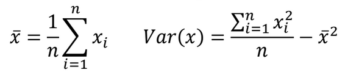
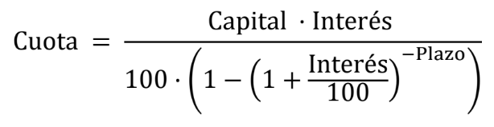
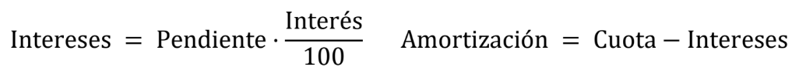

### Relación 2.  
# Estructuras de iteración y selección

> **Clases de programación en C++** · agosto de 2018  
> Miguel Ángel Fernández Gutiérrez ([@mianfg](https://mianfg.bloomgogo.com))

## Ejercicios orientados

### La instrucción `if` simple

##### Ejercicio 2.1. Cálculo del sueldo

En una empresa hay dos tipos de empleados: (F) fijos y (T) temporales. Se establece que el sueldo base es la cantidad bruta que cobran los temporales. Los trabajadores fijos tienen un incremento de 200 euros. A partir del sueldo bruto, hay que calcular el neto descontando un 17% de impuestos. Si el sueldo bruto supera los 1200 euros entonces los impuestos se incrementarán en
un 3%.

Escriba un programa que le pregunte al usuario cuál es el sueldo base establecido para los trabajadores y el tipo de trabajador que es (en ese orden). Como resultado, el programa le indicará cuál es su sueldo bruto y su sueldo neto.

El tipo de trabajador se indicará escribiendo una letra (T o F).

##### Ejercicio 2.2. Datos sin separación

Compruebe el comportamiento del programa anterior si,
cuando pregunta el primer dato (sueldo base), escribimos de forma conjunta sueldo base y tipo de trabajador (sin separación). Por ejemplo, si el sueldo fuese de 1065 euros y el trabajador fuese de tipo fijo escribiríamos 1065F.

### La instrucción `if`/`else`

##### Ejercicio 2.3. Conversión de escalas

Escriba un programa que permita traducir entre grados Celsius (C), Fahrenheit (F), Kelvin (K) y Rankine (R). El programa preguntará en qué unidades damos la temperatura de entrada y a qué escala queremos convertir.

Para ello sabemos que:

* _K_ = _C_ + 273.15
* _R_ = _F_ + 459.67
* 9 * _C_ = 5 * (_F_ − 32)

Tenga en cuenta que el programa pregunta la temperatura y que ésta se introduce como un número seguido de dos letras que indican las unidades. Por ejemplo:

> 35CF indica que queremos pasar 35º Celsius (C) a grados Fahrenheit (F).

**Importante:** no se permite usar operadores lógicos (`&&`, `||`, `!`). Posiblemente la primera idea que nos viene a la cabeza para resolver este problema es establecer las fórmulas para convertir de todas a todas las escalas. Esto nos da un total de 4*4=16 fórmulas diferentes (si tuviésemos más escalas, la cantidad de fórmulas
aumenta rápidamente). Esta solución, además, necesitaría el uso de condiciones compuestas (que usan operadores lógicos). Piense en una solución alternativa.

### Condiciones compuestas: operadores lógicos

##### Ejercicio 2.4. Pascua

La fecha del domingo de Pascua corresponde al primer domingo después
de la primera luna llena que sigue al equinoccio de primavera. El algoritmo que se presenta a continuación (denominado Cómputus) permite calcular esta fecha y es válido para años comprendidos entre 1900 y 2100. Para un determinado año, los cálculos que hay que realizar son:

* _A_ = _año_ mod 19
* _B_ = _año_ mod 4
* _C_ = _año_ mod 7
* _D_ = (19 * _A_ + 24) mod 30
* _E_ = (2 * _B_ + 4 * _C_ + 6 * _D_ + 5) mod 7
* _N_ = (22 + _D_ + _E_)

El valor de _N_ corresponde al día de marzo en el que se sitúa el domingo de Pascua.

En el caso de que sea mayor que 31, el valor se refiere a un día de abril. Además, hay dos excepciones:

1. Si la fecha obtenida es el 26 de abril, entonces caerá en el 19 de abril.
2. Si es el 25 de abril, con _D_=28, _E_=6 y _A_>10, entonces es el 18 de abril.

Escriba un programa que lea un año y muestre el día y mes en el que se celebró o celebrará el domingo de pascua para ese año.

En la siguiente lista tiene algunos datos para verificar que el ejercicio es correcto:

> * Año 2005 ⇒ Pascua el 27 de marzo
> * Año 2011 ⇒ Pascua el 24 de abril
> * Año 2049 ⇒ Pascua el 18 de abril
> * Año 2076 ⇒ Pascua el 19 de abril.

##### Ejercicio 2.5. Rectángulo

> ⭐ Este es un ejercicio recomendado.  
> 🤔 Este ejercicio es de dificultad **alta**.

Escriba un programa que lea las coordenadas que definen un
rectángulo –dos esquinas opuestas– y las coordenadas de un punto en el espacio.

A continuación, el programa escribe en la salida estándar si está en el interior, en el exterior, o en el borde del rectángulo determinado por los dos puntos introducidos.

Además, tenga en cuenta que no sabemos las esquinas que introduce el usuario, simplemente, que son esquinas opuestas.

**Nota:** No use operadores aritméticos.

##### Ejercicio 2.6. Fecha correcta

> ⭐ Este es un ejercicio recomendado.

Escriba un programa que lea una fecha –día, mes y año– y
compruebe si es válida. Para ello, use una única instrucción if/else (con una condición compuesta) que escriba si es correcta o no, es decir:

1. El año debe ser mayor que cero, y el mes debe estar entre 1 y 12.
2. El día debe ser un valor entre 1 y un valor. Tendremos en cuenta que:
    * Los meses que tienen 31 días son 1, 3, 5, 7, 8 ,10 y 12.
    * Los meses que tienen 30 días son 4, 6, 9 y 11.
    * El mes 2 tiene 28 días, excepto los años bisiestos.
    * Un año es bisiesto si es divisible por 4 y no por 100, o si es divisible por 400.

### Evaluación en corto

En la mayoría de los casos, el orden de los operandos en las condiciones que incluyen operadores lógicos no es importante, ya que el resultado es el mismo. Sin embargo, pueden aparecer casos en los que sea necesario escribirlo con cierto orden, y aprovechar la evaluación en corto para evitar un error en tiempo de ejecución.

Esta situación se puede dar cuando una condición incluye un operador lógico sobre dos expresiones, y la primera expresión determina una condición que -dependiendo de su valor- podría implicar que no se puede evaluar la segunda.

##### Ejercicio 2.7. Divisor

Escriba un programa que lea dos números enteros y escriba en la salida
estándar si el segundo divide al primero. Para ello, use una instrucción if/else con una condición simple que hace uso del operador módulo (%) para saber si la condición se cumple.

Compruebe el resultado de este programa si damos como segundo número el cero.

##### Ejercicio 2.8. Divisor (correcto)

Como habrá comprobado, el funcionamiento del programa del
[ejercicio 2.7](#ejercicio-27-divisor) es incorrecto si el segundo número es cero. Solucione este problema.

Para ello, modifique la condición de la instrucción if/else de forma que ahora sea una condición compuesta que verifique que:

* El segundo número divide al primero (usando el operador `%`).
* El segundo número es distinto de cero.

Compruebe si el orden de las subexpresiones afecta al funcionamiento del programa.

### El bucle `do`-`while`

##### Ejercicio 2.9. Lectura con `do`-`while`

> ⭐ Este es un ejercicio recomendado.

Escriba un programa para leer un entero positivo.

##### Ejercicio 2.10. Menú y circunferencia

> ⭐ Este es un ejercicio recomendado.

Realice un programa que permita realizar algunos cálculos sobre una circunferencia. En concreto calculará el área del círculo y el perímetro correspondiente. El programa presentará un menú de opciones al usuario como el siguiente:

1. Cambiar el valor del radio
2. Mostrar el valor del radio
3. Calcular el área del círculo
4. Calcular el perímetro de la circunferencia
5. Finalizar el programa

Al comienzo, el radio de la circunferencia se inicializará a 1. La estructura del programa consistirá en un bucle de tipo do−while cuyo cuerpo consistirá en presentar el menú, leer una opción desde la entrada estándar y finalmente ejecutar y mostrar el resultado de la acción seleccionada mediante una estructura de bifurcación `switch`.

### El bucle `while`

La característica que diferencia a este bucle del bucle `do`−`while` es que la comprobación para ver si hay que iterar o no se hace previa a la ejecución del cuerpo del bucle. Por este motivo cabe la posibilidad de que no llegue a iterar ninguna vez si la condición es falsa al comenzar el bucle.

Podríamos considerar que este bucle, por tanto, abarca más posibilidades que el bucle `do`−`while`. El número de iteraciones será siempre mayor o igual a cero mientras que en el caso del `do`−`while` el número de iteraciones es mayor o igual a uno. Probablemente, este es uno de los motivos por los que el bucle `while` se usa más que el bucle `do`−`while`.

#### Forzar la primera iteración de `while`

Aunque la teoría dice que el bucle `do`−`while` se ejecuta al menos una vez, no debe pensar que se debe optar por éste en caso de que sepamos que se debe ejecutar al menos una vez. El bucle `while` también se ejecutará una vez si, al llegar a él, sabemos que la condición se evalúa como `true`. En estos casos, es posible que nos parezca más legible y fácil de entender una solución con un bucle `while`.

##### Ejercicio 2.11.  Forzar la primera iteración del bucle `while`

> ⭐ Este es un ejercicio recomendado.

Considere el [ejercicio 2.9](#ejercicio-29-lectura-con-do-while). Sustituya el bucle `do`−`while` por otro de tipo `while`. Debe realizar este ejercicio sin añadir nuevas instrucciones de lectura de datos (`cin>>`).

##### Ejercicio 2.12. Procesamiento de datos con `while`

> ⭐ Este es un ejercicio recomendado.

Amplíe el [ejercicio 2.11](#ejercicio-211--forzar-la-primera-iteración-del-bucle-while) con el código necesario para contar el número de dígitos que componen el número que se ha leído. Debe usar un bucle de tipo `while` para esta tarea.

#### Lectura de datos con centinela

Como hemos visto antes, es frecuente usar el bucle `do`−`while` para filtrar los datos de entrada de un programa de una forma simple. También es muy frecuente encontrar problemas en los que hay que procesar una secuencia de datos que termina con un dato particular, al que denominamos **“centinela”**, y que indica que han finalizado los
datos de entrada. En estas situaciones es habitual usar un bucle de tipo `while`.

##### Ejercicio 2.13. Lectura y procesamiento de datos con centinela

> ⭐ Este es un ejercicio recomendado.

Escriba un programa que lea una serie de números enteros positivos y que al terminar muestre la sumatoria de todos ellos. Para terminar, el usuario dará un valor negativo. Por ejemplo, si la secuencia de datos que da el usuario es esta:

~~~
2 6 9 3 -1
~~~

el programa dirá que su suma es `20` (observe que el valor `-1` no se ha sumado al considerarse una marca especial para finalizar la introducción de datos).

Considere la posibilidad de usar `while` o `do`−`while` y razone cuál de los dos es más adecuado.

- - -

La solución al [ejercicio 2.13](#ejercicio-213-lectura-y-procesamiento-de-datos-con-centinela) tiene una desventaja: repite dos veces la comprobación sobre la validez de los datos en cada iteración, lo cual es ineficiente. En la solución con `while` hay que tener cuidado con la primera iteración ya que antes de entrar al bucle se comprueba la condición del mismo por lo que las variables que intervienen en la misma deben ser inicializadas adecuadamente.

Una solución habitual consiste en modificar el código repitiendo la operación de lectura antes de llegar al bucle. Cuando optamos por esta solución, decimos que realizamos una lectura “adelantada” o “anticipada”.

Llamamos lectura anticipada a la que se realiza antes del bucle para garantizar que la primera comprobación nos permita distinguir si ese primer dato ya es correcto. Un posible esquema de una lectura adelantada es el siguiente:

~~~ c++
leer primer dato;
while (no acabar) {
    procesar dato;
    leer siguiente dato;
}
~~~

Esta opción parece ser contraria a un buen diseño, ya que el hecho de repetir lo mismo en dos lugares distintos puede indicar que la solución es mejorable. Sin embargo, podríamos decir que éste no es el caso, ya que queremos distinguir dos cosas distintas: la lectura del primer dato y del resto.

##### Ejercicio 2.14.  Lectura anticipada con `while`

> ⭐ Este es un ejercicio recomendado.

Modifique el programa del [ejercicio 2.13](#ejercicio-213-lectura-y-procesamiento-de-datos-con-centinela) para implementar la lectura anticipada con el bucle `while`.

###### Ejercicio 2.15. Lectura anticipada para mostrar mensajes de entrada diferentes

> ⭐ Este es un ejercicio recomendado.

Se desea implementar un programa que lea un valor entero en el rango `[0,100]`. La primera petición del dato deberá mostrar el mensaje `“Escriba un valor entero”`. Si el usuario escribe un valor fuera del rango el programa mostrará el mensaje `“El número debe estar en el intervalo [0,100]. Por favor, escriba otro número”` y pedirá de nuevo el dato.

##### Ejercicio 2.16. Lectura anticipada con centinela

> ⭐ Este es un ejercicio recomendado.

Se desea implementar un programa que cuente la cantidad de datos que son positivos y negativos en una secuencia de valores enteros. Implemente un programa que lea datos hasta que se lea el valor cero. Como resultado, indicará por la salida estándar cuántos han sido positivos y cuántos han sido negativos.

#### ¿Repetir mientras o repetir hasta?

Una cuestión que en muchas ocasiones causa problemas cuando se comienza a programar con estructuras iterativas es la confusión en la interpretación de la condición del bucle. Como se ha visto, los bucles en C++ iteran mientras la condición sea cierta. Sin embargo, a veces es más natural que pensemos en la condición que debe cumplirse para finalizar la iteración. En este caso estaríamos pensando con la
lógica opuesta: iterar hasta que se cumpla cierta condición.

Por ejemplo, si deseamos crear un bucle que lea datos desde la entrada estándar hasta que uno de ellos sea negativo, haríamos esto:

~~~ c++
int num;
do {
    cin >> num;
} while (!(num<0)); // equivale a (num>=0)
~~~

es decir, hemos escrito el bucle con la condición contraria a la que hemos expresado con palabras (iterar mientras no sea negativo). En el texto hemos indicado hasta cuándo deseamos iterar pero el lenguaje sólo nos deja expresar el problema en términos de que iteremos mientras ocurra algo.

En este ejemplo la transformación entre una condición de tipo hasta por otra de tipo mientras ha sido sencilla: simplemente se ha negado. Si la condición es más compleja e incluye operadores lógicos como `&&` o `||` la solución sigue siendo la misma: escribir la
condición opuesta. En este caso pueden ser útiles las **leyes de De Morgan** para simplificar las expresiones resultantes o incluyo darles más claridad. Estas leyes dicen:

* `!(a || b) ≡ !a && !b`
* `!(a && b) ≡ !a || !b`

Si en el ejemplo anterior deseamos leer números hasta que se lea un negativo o hasta leer el valor `4`, la condición del `while` quedaría como `(!(num<0 || num==4))`, que aplicando las leyes de De Morgan se podría transformar en `(num>=0 && num!=4)`.

##### Ejercicio 2.17. Repetir mientras o repetir hasta

> ⭐ Este es un ejercicio recomendado.

Escriba un programa que repite la lectura de un número hasta que o bien el número sea múltiplo de 3, o bien el número sea positivo e impar. Escriba la condición en términos de hasta y use las leyes de De
Morgan para simplificarla.

### El bucle `for`

##### Ejercicio 2.18.  Tabla de equivalencia entre dólares y euros

En un banco se necesita disponer de una tabla de conversión entre dólares y euros. Escriba un programa que muestre dicha tabla para un cierto número de dólares. Para ello, el programa pedirá desde la entrada estándar el cambio de moneda en curso –cuántos euros vale un dólar– y el número de dólares para los que se desea tener la conversión. Utilice un bucle de tipo for para resolver el problema.

Una posible ejecución sería la siguiente:

~~~
¿Cuántos euros vale un dólar? 0.733
¿Límite de cambio? 12
Tabla de cambio:
1 $ = 0.733 €
2 $ = 1.466 €
3 $ = 2.199 €
...
11 $ = 8.063 €
12 $ = 8.796 €
~~~

#### Ejecutando un cierto número de veces
##### Ejercicio 2.19. Media y varianza

Escriba un programa que lea un número entero que indica el número de datos y a continuación tantos números reales como indique dicho
entero. Como resultado, escribirá la media y la varianza de dichos datos.

A continuación las ecuaciones de la media y de la varianza:

### Anidamiento de bucles
##### Ejercicio 2.20. Mostrar cuadrado

> ⭐ Este es un ejercicio recomendado.

Escriba un programa que lea un número entero `N` desde la entrada estándar y que a continuación dibuje con asteriscos –en la salida
estándar– un cuadrado de lado `N`. A continuación vemos un ejemplo de ejecución:

~~~
Introduzca el lado del cuadrado: 6
******
******
******
******
******
******
~~~

##### Ejercicio 2.21.  Media de medias

> ⭐ Este es un ejercicio recomendado.

Escriba un programa que lea una serie de temperaturas de diferentes ciudades con el siguiente formato:

~~~
N
T11 T12 ... -100
T21 T22 ... -100
T31 T32 ... -100
...
TN1 TN2 ... -100
~~~

En donde `N` es el número de ciudades. Cada fila es la secuencia de temperaturas de una ciudad. Cada fila puede tener un número diferente de medidas y siempre acabará con un valor especial menor o igual a `-100` (centinela). El programa deberá calcular la temperatura media de cada ciudad y mostrará la máxima de las temperaturas medias, así como el número de ciudad a la que corresponde. A continuación puede ver un ejemplo de ejecución:

~~~
4
13 15 15.6 14 -100
8 12 -100
24.5 27 23.2 24 25 -100
23.7 27.4 29.1 -100
Mayor temperatura media: 26.73333
Ciudad: 4
~~~

Observe que en este ejemplo hay 4 ciudades. A continuación se introducen 4 secuencias de datos (una por cada ciudad). Cada secuencia consta de un número arbitrario de mediciones acabadas siempre con un valor menor o igual a `-100`. En
concreto las medias para cada ciudad son: `14.4`, `10`, `24.74` y `26.73` y, por tanto, la media mayor es `26.73` que se corresponde con la ciudad número `4`.

### Variables lógicas y condiciones compuestas

##### Ejercicio 2.22. Números en rango

> ⭐ Este es un ejercicio recomendado.

Escriba un programa que lea un entero y dos números reales: _n_, _min_ y _max_. Estos valores indican que hay n números de entrada y que deberían estar en el intervalo [_min_, _max_]. A continuación, deberá leer los _n_ valores de entrada y confirmar que todos están en el intervalo indicado. En caso de que uno de los valores no lo esté, parará la lectura y terminará el programa indicando que hay valores fuera de rango. Resuelva el ejercicio usando un ciclo for. A continuación se muestran dos posibles ejecuciones de este programa:

~~~
N, min, max: 3 0.0 5.0
Introduzca valor 0: 2.3
Introduzca valor 1: 2
Introduzca valor 2: 5.0
Los 3 valores introducidos están en el intervalo [0.0,5.0]
~~~

~~~
N, min, max: 3 0.0 10.0
Introduzca valor 0: 12
Error. Finalización inesperada del programa: fuera de rango
~~~

##### Ejercicio 2.23. Cotización de las acciones

> ⭐ Este es un ejercicio recomendado.
> 🤔 Este ejercicio es de dificultad **alta**.

Se desea estudiar cómo progresa la cotización de una acción a lo largo del tiempo. Para ello, escribiremos un programa que lee la
secuencia de valores de una acción. Esta secuencia describe el comportamiento de la acción durante un período de tiempo. El programa deberá escribir como resultado el valor máximo de la acción, el mínimo, la subida máxima, y la bajada máxima. Para determinar el final de la secuencia, se introducirá un valor negativo. Un ejemplo de ejecución es:

~~~
Introduzca un valor: 1.6
Introduzca un valor: 1.9
Introduzca un valor: 1.4
Introduzca un valor: 1.5
Introduzca un valor: -1
Resultados a partir de los tres valores introducidos:
Valor máximo: 1.9
Valor mínimo: 1.4
Subida máxima: 0.3
Bajada máxima: 0.5
~~~

Para finalizar el problema, vuelva a ejecutar el programa para comprobar el resultado con las siguientes secuencias:

> * Secuencia (sin bajadas): `1 2 3 4 5 -1`
> * Secuencia (sin subidas): `5 4 3 2 1 -1`
> * Secuencia (vacía): `-1`

## Relación de ejercicios

##### Ejercicio 2.24. Calculadora

Escriba un programa que lea dos valores reales y que presente un
menú con cuatro alternativas: Suma, Resta, Producto y División. El programa deberá pedir al usuario que seleccione una de las cuatro y presentar en la salida estándar el resultado de la operación correspondiente. Tenga en cuenta que el usuario puede responder a la selección tanto con alguno de los 4 dígitos `1234` como con cualquiera de los cuatro operadores `+ - * /`. Si la respuesta no
corresponde a ninguno de ellos, terminará indicando que la selección es incorrecta. A continuación se presentan dos ejemplos de ejecución.

~~~
Introduzca el primer dato: 2.5
Introduzca el segundo dato: 10
Opciones:
1.- Suma
2.- Resta
3.- Producto
4.- División
¿Qué operación desea realizar (1234+-*/)? *
Resultado: 2.5 * 10 = 25
~~~

~~~
Introduzca el primer dato: 1
Introduzca el segundo dato: 2
Opciones: ...
¿Qué operación desea realizar (1234+-*/)? A
Error, la opción elegida no es correcta
~~~

##### Ejercicio 2.25. Espacio cartesiano

> ⭐ Este es un ejercicio recomendado.
> 🤯 Este ejercicio es de dificultad **muy alta**.

Haga un programa que lea las coordenadas de tres puntos en un espacio cartesiano 2D y que nos diga si forman o no un triángulo. Además, debe indicar si el triángulo es eqilátero. Si llamamos a los puntos A, B y C, sabemos que forman un triángulo cuando la mayor de las distancias AB, AC, BC es menor que la suma de las otras dos. El triángulo es equilátero si las tres distancias son iguales.

##### Ejercicio 2.26. Notas

Escriba un programa que lea un valor entero desde la entrada estándar y que, según sea su valor, escriba alguno (o varios) de los siguientes mensajes:

* Si es negativo escribirá `Es negativo`.
* Si está entre 0 y 5 escribirá `Si fuese una nota sería suspenso`.
* Si vale 2, 4, 8 ó 6 escribirá `Es un número positivo, par y menor que 9`.
* Si no cumple ninguna de las anteriores dirá `Número extraño`.

##### Ejercicio 2.27. Notas (modificado)

Reescriba el [ejercicio 2.26](#ejercicio-226-notas) usando la sentencia `switch`.

##### Ejercicio 2.28. Clasificando caracteres

Escriba un programa que lea un carácter desde la entrada estándar y que diga si:

* Es un dígito.
* Es una letra mayúscula.
* Es una letra minúscula.
* Es un operador aritmético (`+`, `-`, `*`, `/`)
* Es otra cosa.

##### Ejercicio 2.29. Monedas y billetes

Escriba un programa que lea un valor real correspondiente a un pago en euros y que nos indique el número mínimo de monedas y billetes
necesarios para pagar dicha cantidad. Debe asumir que únicamente disponemos de monedas y billetes de 5eur, 2eur, 1eur, 50cts, 20cts, 5cts, 1cts. No tenemos billetes de mayor cuantía ni monedas de 10cts ni 2cts.

Por ejemplo, si el valor a pagar son 7’37 euros, el programa dirá que necesitamos: 1 billete de 5eur, 1 moneda de 2eur, 1 moneda de 20cts, 3 monedas de 5cts y 2 monedas de 2cts.

##### Ejercicio 2.30. Calculadora ampliada

Considere el ejercicio de la calculadora ([ejercicio 2.24](#ejercicio-224-calculadora)). Escriba un programa con el mismo menú, añadiendo tres opciones más:

* Modificar primer operando.
* Modificar segundo operando.
* Fin.

Para ello, tenga en cuenta que el valor inicial de los operandos es cero, y que la solución debe contener un bucle `do`−`while` junto con una instrucción `switch` para gestionar el menú.

##### Ejercicio 2.31. Número perfecto

> 🤔 Este ejercicio es de dificultad **alta**.

Un número perfecto es aquel que es igual a la suma de todos sus divisores positivos excepto él mismo. El primer número perfecto es el 6, ya que sus divisores son 1, 2 y 3 y 6=1+2+3. Escriba un programa que muestre el mayor número perfecto que sea menor a un número dado.

##### Ejercicio 2.32. Número narcisista

> 🤔 Este ejercicio es de dificultad **alta**.

Un número entero de _n_ dígitos se dice que es narcisista si se puede obtener como la suma de las potencias _n_-ésimas de cada uno de sus dígitos. Por ejemplo, 153 = 13+53+33 y 8208 = 84+24+04+84 son números narcisistas. Escriba un programa que lea un número entero positivo y nos diga si es narcisista o no.

##### Ejercicio 2.33. Mostrar figuras

> ⭐ Este es un ejercicio recomendado.
> 🤯 Este ejercicio es de dificultad **muy alta**.

Escriba un programa que lea un número entero `N` desde la entrada estándar y que a continuación dibuje con asteriscos –en la salida
estándar– las siguientes figuras:

1. Triángulo de lado N
2. Cuadrado hueco de lado N
3. Rombo de altura N y de ancho N/2. En este caso N debe ser impar.

A continuación, vemos una muestra de estas figuras para `N=7`:

~~~
*          *******       *
**         *     *      ***
***        *     *     *****
****       *     *    *******
*****      *     *     *****
******     *     *      ***
*******    *******       *
~~~
##### Ejercicio 2.34. _Run Length Encoding_

> ⭐ Este es un ejercicio recomendado.
> 🤯 Este ejercicio es de dificultad **muy alta**.

El método RLE (Run Length Encoding) de codificación permite almacenar en poco espacio largas secuencias de datos. El algoritmo consiste en transformar las secuencias de valores idénticos consecutivos en
parejas compuestas por el valor y el número de repeticiones. Escriba un programa que lea una secuencia de números terminada con un número negativo y la codifique mediante el método RLE. Un ejemplo de ejecución sería el siguiente:

~~~
Introduzca secuencia: 1 1 1 2 2 2 2 2 3 3 3 3 3 3 5 -1
RLE: 3 1 5 2 6 3 1 5
~~~

Donde la salida corresponde a indicar que hay 3 unos, 5 dos, 6 tres y 1 cinco.

##### Ejercicio 2.35. Número feliz

> 🤔 Este ejercicio es de dificultad **alta**.

Se dice que un número natural es feliz si cumple que al sumar los
cuadrados de sus dígitos y repetimos esta suma con los resultados que vamos obteniendo, finalmente obtenemos el dígito 1 como resultado. 

Por ejemplo, el número 203 es un número feliz ya que: 2^2+0^2+3^2 = 13 → 1^2+3^2 = 10 → 1^2+0^2 = 1.

Además, un número es feliz de grado _k_ si es feliz en un máximo de _k_ iteraciones.

En el ejemplo anterior, 203 es un número feliz de grado 3 (además, es feliz de cualquier grado mayor o igual que 3). Escriba un programa que lea un número _n_ y un grado _k_ y diga si _n_ es feliz grado _k_.

##### Ejercicio 2.36. Secuencia más larga

> ⭐ Este es un ejercicio recomendado.
> 🤔 Este ejercicio es de dificultad **alta**.

Escriba un programa que lea una secuencia de enteros positivos terminada en un valor negativo, y que escriba en la salida estándar la
longitud de la subsecuencia de números ordenada de mayor longitud junto con la posición donde comienza. Tenga en cuenta que dos números están ordenados si el primero es menor o igual que el segundo. Un ejemplo de ejecución es:

~~~
Secuencia (termina con negativo): 5 9 1 4 8 8 10 5 14 -1
Máxima longitud: 5 comenzando en 2
~~~

Observe que el elemento con índice 2 –el número 1– es el comienzo de una secuencia de 5 números ordenados. Para finalizar el problema, vuelva a ejecutarlo para comprobar el resultado de las siguientes secuencias:

> * Secuencia: `-1`
> * Secuencia: `1 2 3 4 5 -1`

##### Ejercicio 2.37. Hipoteca

El valor de la cuota de una hipoteca, dado el capital, el interés y un plazo de devolución se puede calcular como:

donde, como consideramos cuotas mensuales, el interés es el mensual –interés anual entre 12– y el plazo es el número de meses que dura la hipoteca.

Como sabemos, las cuotas son idénticas todos los meses (supongamos que es a plazo fijo), pero realmente en las primeras se dedica un mayor porcentaje a intereses. Concretamente, para calcular la parte de intereses y de capital que se paga (amortización), tenemos que calcular:

donde “interés” de nuevo es el interés mensual, y “pendiente” es el capital que aún queda por pagar. Inicialmente será el total del préstamo, y cada mes disminuirá en tanto como sea la amortización.

Escriba un programa para, a partir de los valores que definen un préstamo (capital, interés anual y el plazo en años) conocer cómo se irá pagando. Para ello, tenga en cuenta que debe escribir todas las tripletas de valores (pendiente, intereses, amortización) que corresponden a cada mes. Además, para cada año -es decir, tras doce tripletas- se dará un mensaje con el total de interés y amortización que se ha pagado durante ese año.
